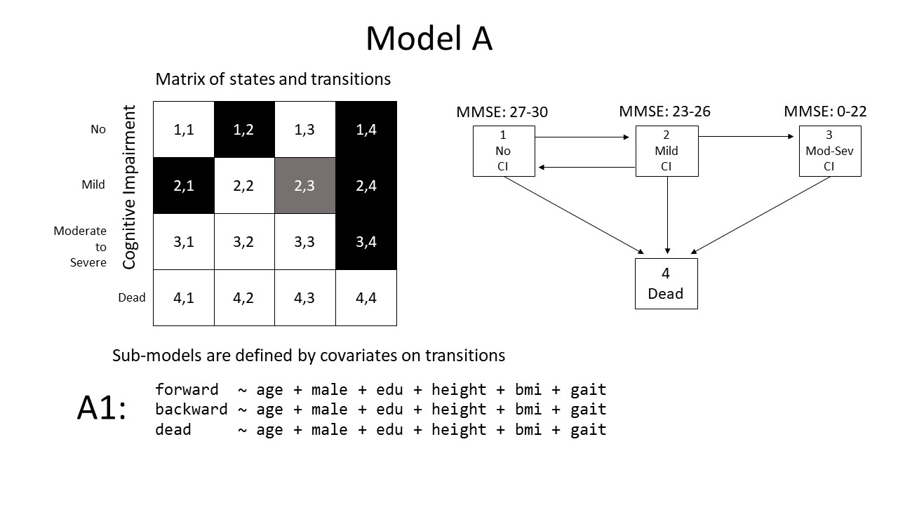

# ialsa-2018-amsterdam

Mutistate models of physical decline: Coordinated analysis with replication across several longitudinal studies.

([reproducible workflow described][how-to-reproduce])

# Research Question

> Is gait speed associated with transitions among cognitive states?

# Model specification

 

# Shared Point of Departure

The following online documents are developed collectively to serve as the basis for manuscript development

- [Fact Tables][fact-tables] - Procedural and numerical facts about the longitudinal studies engaged in the replication analysis. 

- [Meeting Journal][meeting-journal] - Account of the meetings among the participants and the administrative hub of the project (view by invite only, must sign in to view).

[meeting-journal]:https://docs.google.com/document/d/1LHnAU9Be693COvB0NJlyseifrnY0F9osLs1LWSGLXH4/edit?usp=sharing
[fact-tables]:https://docs.google.com/document/d/1MjiRhF1veKZ2xaN085XAr83w4eSzWRrOFVDuGMEluA0/edit?usp=sharing

[how-to-reproduce]:how-to-reproduce.md