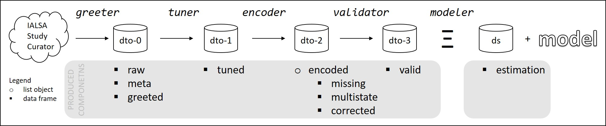

<!-- These two chunks should be added in the beginning of every .Rmd that you want to source an .R script -->
<!--  The 1st mandatory chunck  -->
<!--  Set the working directory to the repository's base directory -->
```{r, echo=F, message=F} 
#Don't combine this call with any other chunk 
# cat("Working directory: ", getwd()) # check where you are
  library(knitr)
# Rmd is in "./reports/reportA/reportA.Rmd", but now the root is "./"
  knitr::opts_knit$set(root.dir='../../../') 
  # getwd()
```
<!--  The 2nd mandatory chunck  -->
<!-- Set the report-wide options, and point to the external code file. -->
```{r set_options, echo=F}
# set options shared by all chunks
opts_chunk$set(
  results='show', 
  message = TRUE,
  warning = FALSE, 
  comment = NA, 
  tidy = FALSE,
  fig.height = 4, 
  fig.width = 5.5, 
  out.width = "960px",
  fig.path = 'figure_rmd/',     
  dev = "png",
  dpi = 100
  # fig.path = 'figure_pdf/',     
  # dev = "pdf"#,
  # dev.args=list(pdf = list(colormodel = 'cmyk'))
)
# echoChunks <- TRUE
echoChunks <- FALSE
options(width=120) #So the output is 50% wider than the default.
# connect to the file with the underlying R script  
read_chunk("./reports/descriptives/map/review-variables-map.R") 
```


<!-- Load 'sourced' R files.  Suppress the output when loading packages. --> 
```{r load-packages, echo=echoChunks, message=FALSE}
```


<!-- Load the sources.  Suppress the output when loading sources. --> 
```{r load-sources, echo=echoChunks, message=FALSE}
```


<!-- Load any Global functions and variables declared in the R file.  Suppress the output. --> 
```{r declare-globals, echo=echoChunks, results='show', message=FALSE}
```

<!-- Declare any global functions specific to a Rmd output.  Suppress the output. --> 
```{r, echo=echoChunks, message=FALSE}
#Put code in here.  It doesn't call a chunk in the codebehind file.
```


In this report we review the variables in the Memory and Aging Project (MAP) study of RUSH Institute.

# (I) Exposition

This report is a record of interaction with a data transfer object (dto) produced by sequence of scripts  

- `./manipulation/map/0-greeter-map.R`   
- `./manipulation/map/1-tuner-map.R`   
- `./manipulation/map/2-encoder-map.R`   
- `./manipulation/map/3-validator-map.R`   

Their roles are described in the following chain of custody:

 


## Overview of objects  

Let us review the data objects in this chain of custody. We will mostly use the `dto$valid` dataset, as the one containing all (and only) necessary variable for our modeling exercise and only those cases/subjects that were considered eligible from the data quality perspective. 

<!-- Load the datasets.   -->
```{r load-data, echo=T, results='show', message=FALSE}
```

## Meta

The `dto` contains the meta data set, descrdibing the existing variables. This spreadsheet is the means by which variables are studied, classified, described, and annotated.  The process of applying this meta data file to alter the `raw` form is described in the `./manipulation/map/0-greeter-map.R` script.

```{r meta-table, echo=FALSE, results='show', message=FALSE}
```

## How to interact

Now that the full chain of custody is loaded into our analytic environment, we can demonstrate some of the ways we can interact with `dto` to set the stage for data visualization to follow. 
<!-- Inspect the datasets.   -->
```{r inspect-data-1, echo=T, results='show', message=FALSE, eval=F}
```

## A few basic Qs

> What is the difference between `dto$valid` and `ds_estimation`? 

If all elibible cases (from perspective of data cleanliness) are employed during estimation, these two data sets should have the same cases.

```{r inspect-data-2, echo=T, results='show', message=FALSE}
```

## Contents 

To be explicit about the content of the focal data set for this report, we list its geneology and local transformations in the following call. 
<!-- Tweak the datasets.   -->
```{r tweak-data, echo=T, results='show', message=FALSE}
```

Now that the `valid` data set is loaded up into our environment and we understand its relationship to `ds_estimation` we can look at what data displays for individual cases.  
```{r inspect-data-3, echo=T, results='show', message=FALSE}
```

<!-- Basic table view.   -->
```{r basic-table, echo=TRUE, results='show', message=FALSE}
```

<!-- Basic graph view.   -->
```{r basic-graph, echo=TRUE, results='show', message=FALSE}
```

# (II) - Development

# Age

```{r age-1, echo=TRUE, results='show', message=FALSE, eval=T}
```


# Education
```{r B-4-education, echo=TRUE, results='show', message=FALSE, eval=T}
```

# BMI
```{r B-6-bmi, echo=TRUE, results='show', message=FALSE, eval=T}
```

# Cognition

Let us review variables related to cognitive health.

## Global cognition
```{r B-2-cognitive-5-cogn_global, echo=TRUE, results='show', message=FALSE, eval=T}
```

## Dementia
```{r B-3-dementia-diagnosis, echo=TRUE, results='show', message=FALSE, eval=T}
```

## MMSE
```{r B-2-cognitive-5-mmse, echo=TRUE, results='show', message=FALSE, eval=T}
```

# Gait
```{r gait-1, echo=TRUE, results='show', message=FALSE, eval=T}
```


# (III) - Recapitulation